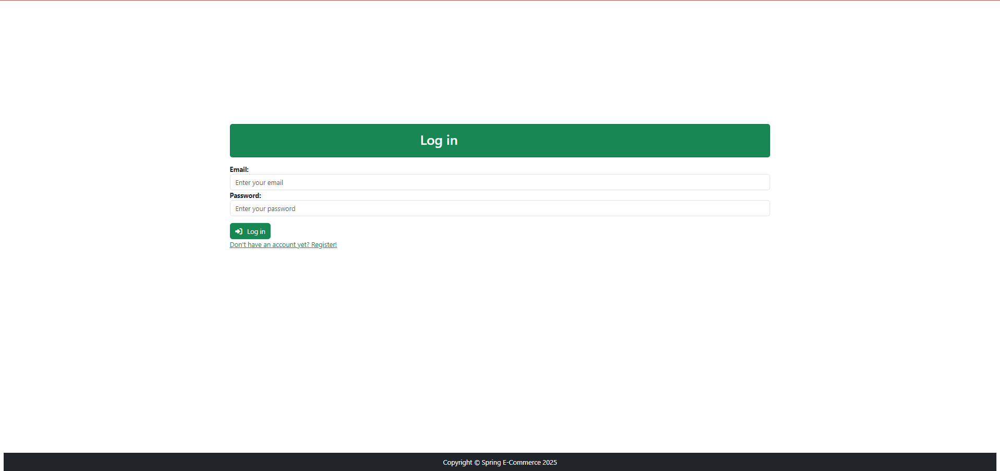
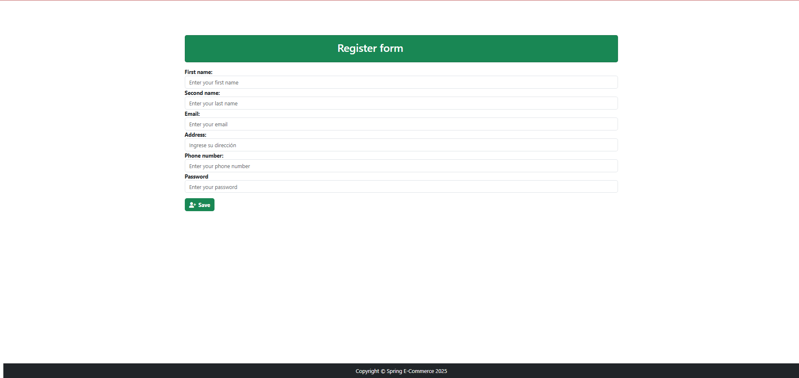
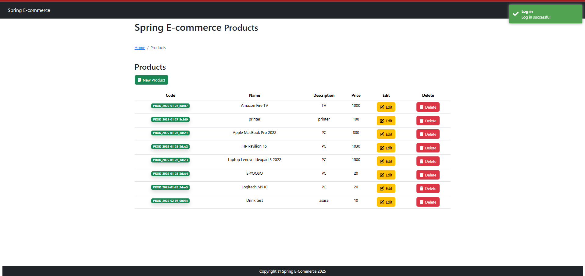
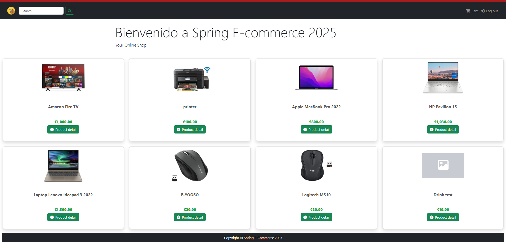
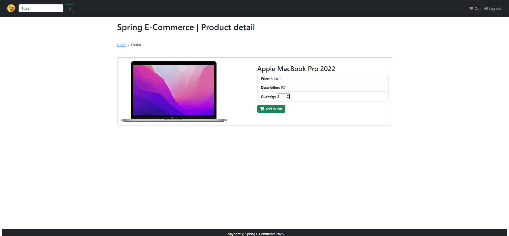
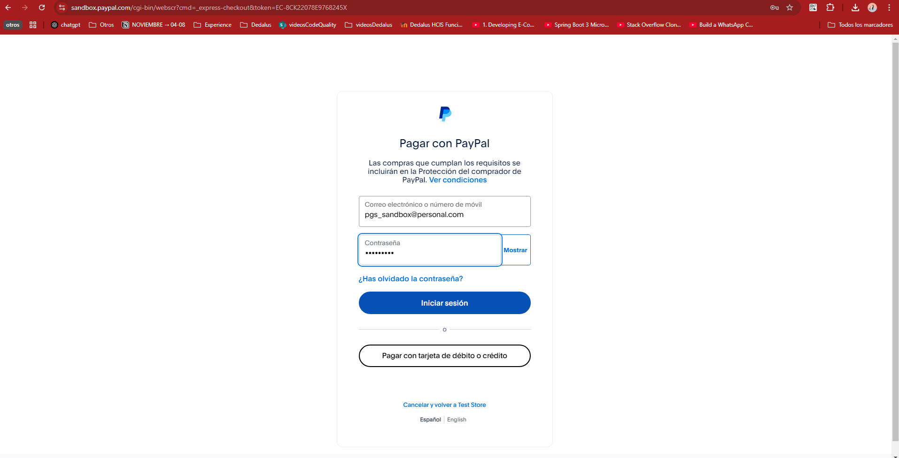
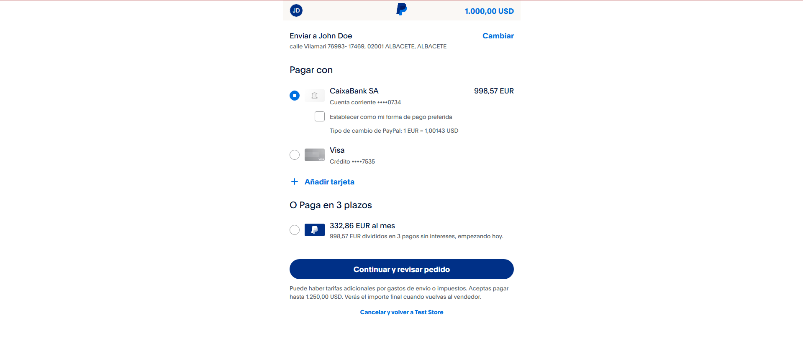
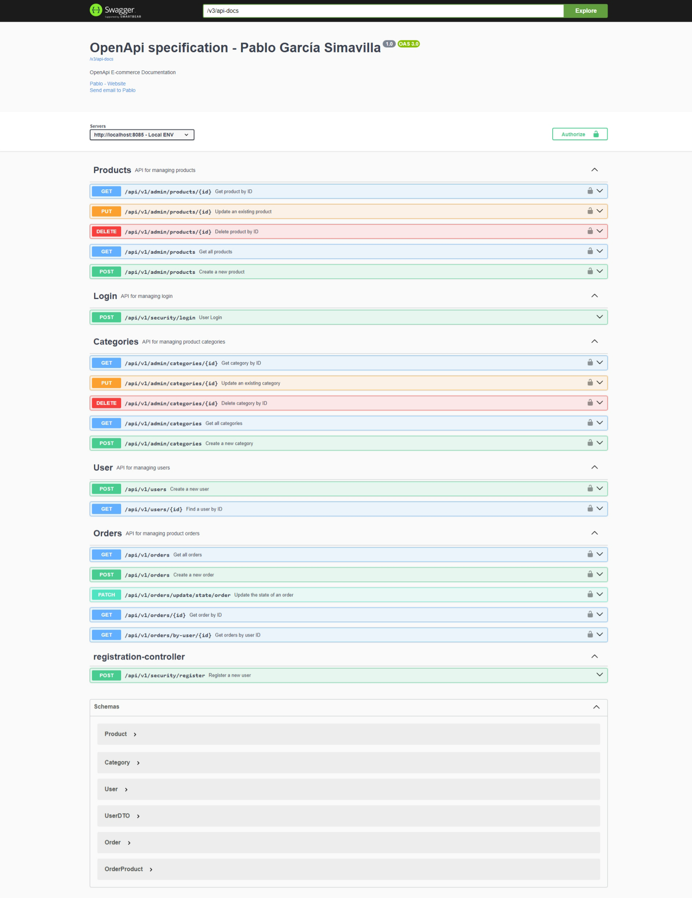

# E-commerce Full Stack Application

This is a full-stack E-commerce application built with Angular (frontend) and Java Spring Boot (backend). The application supports two user roles: **Admin** and **User**.

- **Admin**: Can perform CRUD operations on categories, products, and users.
- **User**: Can browse products, add them to the cart, and create orders (integrated with PayPal Sandbox for payments).

---

## Frontend Repository

The frontend of the application is built with Angular and can be found at:

[Frontend Repository - Angular](https://github.com/PagarciaSima/E-commerce-Angular-01-25-)

---

## Features
- **User Authentication**: Secure login and JWT-based authentication.
- **Role-Based Access Control**: Different functionalities for Admin and User.
- **Product Management**: CRUD operations for products (Admin only).
- **Category Management**: Manage product categories (Admin only).
- **User Management**: Admin can manage user accounts.
- **Shopping Cart**: Users can add/remove products to/from the cart.
- **Order Processing**: Users can place orders and make payments via PayPal Sandbox.
- **API Documentation**: Integrated with OpenAPI for API documentation.
- **Unit Testing**: Mockito for backend unit tests.

---

## Technologies

### Backend (Spring Boot 3.4.0 / Java 17)
- **Spring Boot 3.4.0**
- **Spring Data JPA** (Database access)
- **Spring Security & JWT** (Authentication & Authorization)
- **PostgreSQL** (Database)
- **Lombok** (Boilerplate code reduction)
- **MapStruct** (Object Mapping)
- **dotenv** (Environment variables management)
- **Mockito** (Unit testing)
- **OpenAPI** (API documentation)

### Frontend (Angular 16)
- **Angular 16** (Core framework)
- **Bootstrap 5.3.3** (Styling & layout)
- **ngx-toastr** (Notifications)
- **SweetAlert2** (Custom alerts & modals)
- **FontAwesome** (Icons)
- **RxJS** (Reactive programming)

---

## Interfaces 

### Login

### Register

### Admin / products

### Admin / Create-Edit products

### Admin / Categories

### User / Home

### Product detail

### PayPal Payment Sandbox

---

## Open Api Doc
 

## Extras

- **Database (BDD)**: The database used is PostgreSQL. The database schema, along with the scripts for table creation and initial data, can be found in the "extras" directory.

- **Postman Collection**: You can find the Postman collection to test all the API endpoints in the "extras" directory.
